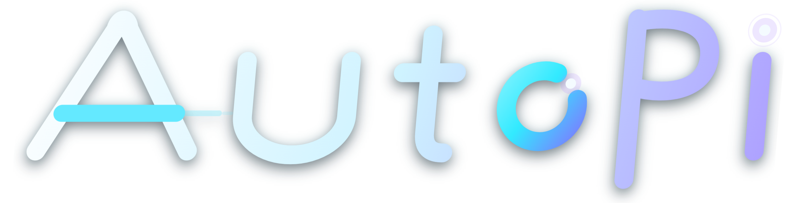

<p align="center">
  
</p>

<h1 align="center">AutoPi</h1>

<p align="center">
  <strong>English</strong> · <a href="README.zh-CN.md">简体中文</a>
</p>

<p align="center">
  One AI agent across desktop, VS Code, and the command line—built to manage long-running tasks and continue automatically when time, file, process, or task conditions are met.
</p>

<p align="center">
  <a href="https://github.com/shoelace66/AutoPi/releases/latest"></a>
  <a href="https://github.com/shoelace66/AutoPi/actions/workflows/ci.yml"></a>
  <a href="LICENSE"></a>
  
  
  
</p>

> [!IMPORTANT]
> AutoPi is an independently maintained fork of [earendil-works/pi](https://github.com/earendil-works/pi), forked on **August 20, 2026** from Pi `0.84.1` at commit [`31b513e3`](https://github.com/earendil-works/pi/commit/31b513e316ab2b5ec736268350635511297fa3c1). AutoPi evolves independently and does not automatically track later upstream releases. See [UPSTREAM.md](UPSTREAM.md) for complete provenance and attribution.

## Download and get started

### Recommended for new Windows users: portable desktop package

1. Open the [latest release](https://github.com/shoelace66/AutoPi/releases/latest).
2. Download `AutoPi-0.84.1-win-x64.zip`.
3. Right-click the ZIP and select **Extract All**. Do not run the application from the archive preview.
4. Double-click `AutoPi.exe` in the extracted directory.
5. Select **Open Folder** and choose the project you want AutoPi to work on.
6. Choose a model, configure the corresponding API key, and describe your task in plain language.

The release root includes `START-HERE-开始使用.txt`, licenses, a build manifest, and SHA-256 verification data. The portable build does not write to system directories or require administrator privileges; remove it by deleting the extracted folder.

> Windows SmartScreen might warn about a new application that has not yet been commercially code-signed. Verify that the package came from this repository and compare it with the `.sha256` file in the same release before selecting **More info → Run anyway**.

For a more detailed walkthrough, see the [zero-experience Chinese guide](docs/GETTING-STARTED.zh-CN.md).

### Linux x64 command-line package

1. Download `AutoPi-0.84.1-linux-x64.tar.gz` and its matching `.sha256` file.
2. Run `sha256sum -c AutoPi-0.84.1-linux-x64.tar.gz.sha256`.
3. Extract the archive, enter its directory, and run `./autopi`.

The Linux package includes `autopi`, the compatible `pi` command, `pi-wake`, and the required runtime. Node.js is not required. It targets glibc x64 distributions including Ubuntu 22.04/24.04 and Debian 12. See the [Linux x64 beginner guide](docs/LINUX-GETTING-STARTED.en.md).

### VS Code users: platform-specific VSIX

1. Download `AutoPi-0.84.1-win32-x64.vsix` for Windows or `AutoPi-0.84.1-linux-x64.vsix` for Linux, Remote SSH, and WSL, together with the matching `.sha256` file.
2. In the VS Code Extensions view, select **Install from VSIX…** from the top-right menu.
3. Open and trust your project folder.
4. Run **AutoPi: Configure API Key**, then open AutoPi from the Activity Bar.

Each VSIX includes an AutoPi x64 backend for its target platform. Users do not need to install Node.js or the AutoPi CLI separately. Remote workspaces require the Linux VSIX in the remote extension host. See the [VS Code setup guide](docs/VSCODE-GETTING-STARTED.zh-CN.md) for installation, checksum verification, configuration, logs, and a training-to-evaluation example.

### Command-line users

The Windows package also includes:

- `autopi.cmd` to launch the AutoPi CLI;
- `pi.cmd` as a compatibility entry point for Pi;
- `pi-wake.cmd` to deliver Wake events to an online AutoPi session.

The Linux package provides extensionless `autopi`, `pi`, and `pi-wake` executables.

## What AutoPi can do

| Capability | Description |
| --- | --- |
| Desktop workspace | Graphical sessions, project files, Git, terminals, models, and activity state, with the most recent session restored per workspace. |
| VS Code sidebar | Independent of Copilot and built-in Chat; isolates sessions per workspace and shows tools, approvals, background tasks, logs, and generated files. |
| CLI / TUI / SDK / RPC | Preserves Pi's native command line, terminal UI, SDK, RPC, session, and extension compatibility. |
| General background tasks | Starts long commands through `background_task`, recording a task ID, PID, exit code, timestamps, stdout/stderr log, and cancellation state. |
| Automatic continuation | Uses one `outer_loop` tool to wait for time, file changes, process exit, or managed-task completion, then resumes the same session. |
| Wake infrastructure | Per-session queues, capability checks, request deduplication, local IPC, cancellation, and JSONL diagnostics. |
| Light and dark themes | AutoPi Dark uses the `#090D20` brand foundation; AutoPi Light switches to inverse wordmarks and the light icon automatically. |
| Verifiable delivery | Windows portable desktop, Linux x64 CLI, platform-specific VSIX packages, build manifests, and SHA-256 checksums. |

### An automatic-continuation example

Tell AutoPi:

```text
Run the project build. If it is still running, wait for it to finish, then inspect the result and fix any errors.
```

It can also continue on time or file events:

```text
Check the logs again in 10 minutes.
Wait until output.json changes, then read the result and generate a report.
```

Or describe a complete workflow in one instruction:

```text
After training succeeds, run the test set, analyze the real output, and write a report to reports/eval.md. If any stage fails, stop the remaining stages and explain why.
```

Computer vision is only an acceptance example. AutoPi does not hard-code a training framework, dataset schema, or report template. Commands, artifacts, and report formats come from the user's instruction and the current repository.

AutoPi can continue receiving messages after registering a wait. Obsolete waits and tasks can be cancelled by either the user or the agent.

## Current boundaries

- Wake registrations live only as long as the corresponding AutoPi process. Pending waits are not automatically resumed after a full restart.
- Background tasks live with the corresponding AutoPi or VS Code process. Closing the host terminates managed process trees; the next launch shows recovery information without automatically rerunning work.
- Local Wake targets online sessions only. It is not an offline queue, cross-machine transport, or managed scheduling service.
- The first Linux release supports glibc x64 only, not Alpine/musl, ARM64, or the Electron desktop application.
- Third-party email, chat, and MCP connectors are not bundled in release packages; they can be added through extensions or external programs.
- AutoPi is not a sandbox. It reads files and runs commands with the current user's permissions. Open only trusted workspaces and review high-risk operations.

## Product architecture

```text
AutoPi Desktop   AutoPi VS Code   AutoPi CLI / TUI / SDK / RPC
        \              |                    /
                 AgentSession
                       |
               Pi-compatible loop
                       |
       BackgroundTaskManager + WakeRuntime
       task · timer · file · process · IPC
```

Desktop, VS Code, and the command line are not separate agents. They share `@earendil-works/pi-coding-agent`, model configuration, session files, extensions, tools, and the Wake runtime.

## Run from source

Node.js `22.19+` is required. On Windows:

```powershell
git clone https://github.com/shoelace66/AutoPi.git
cd AutoPi
npm install --ignore-scripts
npm run build:offline
.\autopi.bat
```

Start the CLI directly:

```powershell
.\autopi.bat --cli
```

macOS and Linux currently focus on the CLI:

```bash
git clone https://github.com/shoelace66/AutoPi.git
cd AutoPi
npm install --ignore-scripts
npm run build:offline
./autopi.sh --cli
```

The regular `npm run build` attempts to refresh the online model catalog. Prefer `npm run build:offline` in offline or network-restricted environments.

## Development and verification

```bash
npm run check
npm --workspace @autopi/desktop test
npm run test:vscode
```

Build verified release packages:

```powershell
npm run package:desktop
npm run package:cli:linux
npm run package:vscode:windows
npm run package:vscode:linux
```

Artifacts are written under `.artifacts`:

- `AutoPi-<version>-win-x64/`
- `AutoPi-<version>-win-x64.zip`
- `AutoPi-<version>-win-x64.zip.sha256`
- `cli/AutoPi-0.84.1-linux-x64.tar.gz`
- `cli/AutoPi-0.84.1-linux-x64.tar.gz.sha256`
- `vscode/AutoPi-0.84.1-win32-x64.vsix`
- `vscode/AutoPi-0.84.1-win32-x64.vsix.sha256`
- `vscode/AutoPi-0.84.1-linux-x64.vsix`
- `vscode/AutoPi-0.84.1-linux-x64.vsix.sha256`

Desktop packaging re-extracts the ZIP and verifies the build ID, component hashes, and directory-tree digest. Maintainers can also run `npm run release:desktop` to synchronize the same build to `D:\PiDesktop`.

## Repository guide

| Path | Purpose |
| --- | --- |
| [`apps/desktop`](apps/desktop) | AutoPi Electron desktop application |
| [`apps/vscode`](apps/vscode) | AutoPi VS Code extension, sidebar, and host communication layer |
| [`packages/coding-agent`](packages/coding-agent) | CLI, sessions, extension API, and agent integration |
| [`packages/coding-agent/src/core/background-task`](packages/coding-agent/src/core/background-task) | General background commands, logs, state, and process-tree cleanup |
| [`packages/coding-agent/src/core/wake`](packages/coding-agent/src/core/wake) | Wake runtime, queue, IPC, capabilities, and diagnostics |
| [`packages/coding-agent/src/core/outer-loop`](packages/coding-agent/src/core/outer-loop) | Time, file, process, task monitors, and the `outer_loop` tool |
| [`docs/GETTING-STARTED.zh-CN.md`](docs/GETTING-STARTED.zh-CN.md) | Beginner desktop guide in Chinese |
| [`docs/VSCODE-GETTING-STARTED.zh-CN.md`](docs/VSCODE-GETTING-STARTED.zh-CN.md) | VSIX installation, configuration, and training-to-test example in Chinese |
| [`docs/LINUX-GETTING-STARTED.en.md`](docs/LINUX-GETTING-STARTED.en.md) | Linux CLI, VSIX, Remote SSH, and WSL guide |
| [`docs/AUTOPI-DESKTOP.md`](docs/AUTOPI-DESKTOP.md) | Desktop integration and release notes |
| [`README-OUTER-LOOP.md`](README-OUTER-LOOP.md) | Wake and Outer Loop behavior and interface details |
| [`UPSTREAM.md`](UPSTREAM.md) | Upstream baseline, inherited scope, and attribution |

## Contributing and security

Read [CONTRIBUTING.md](CONTRIBUTING.md) and [AGENTS.md](AGENTS.md) before submitting changes. Report security issues through GitHub's private security reporting flow as described in [SECURITY.md](SECURITY.md); do not disclose credentials or exploitable details publicly.

## Upstream and license

AutoPi preserves Pi's Git history, package structure, native agent loop, CLI/TUI/SDK/RPC interfaces, extension compatibility, and MIT license attribution. AutoPi's desktop product, VS Code extension, Wake runtime, Outer Loop integration, and delivery tooling are also released under the MIT License.

Thanks to [Mario Zechner](https://github.com/badlogic), [earendil-works/pi](https://github.com/earendil-works/pi), and every upstream contributor. See [UPSTREAM.md](UPSTREAM.md) and [LICENSE](LICENSE) for details.
